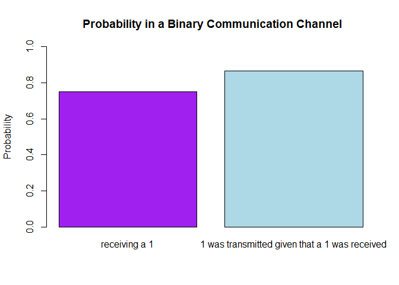
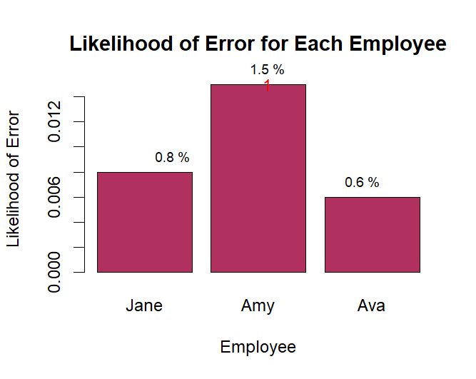

FA 3
================
Cuerdo, Naomi Hannah A.
2024-02-24

## Problem 1

A binary communication channel carries data as one of two sets of
signals denoted by 0 and 1. Owing to noise, a transmitted 0 is sometimes
received as a 1, and a transmitted 1 is sometimes received as a 0. For a
given channel, it can be assumed that a transmitted 0 is correctly
received with probability 0.95, and a transmitted 1 is correctly
received with probability 0.75. Also, 70% of all messages are
transmitted as a 0. If a signal is sent, determine the probability that:

1)  a 1 was received;
2)  a 1 was transmitted given than a 1 was received.

### Initialization

``` r
#probability of receiving a 1

receive_1 <- 0.75

#probability of receiving a 0

receive_0 <- 0.95
```

### Calculating the transmissions

``` r
#probability of transmitting a 1

transmit_1 <- (0.3 * 0.75) + (0.7 * 0.05)

#probability of transmitting a 0

transmit_0 <- (0.7 * 0.95) + (0.3 * 0.25)
```

## Output

``` r
#probability of receiving a 1

receive_1
```

    ## [1] 0.75

``` r
#probablity a 1 was transmitted given that a 1 was received.
transmit_1_given_1 <- (0.3 * 0.75) / transmit_1

transmit_1_given_1
```

    ## [1] 0.8653846

## Figure 1. bar plot representation

``` r
barplot(c(receive_1, transmit_1_given_1), names.arg = c("receiving a 1", "1 was transmitted given that a 1 was received"),
ylim = c(0, 1), col = c("purple", "lightblue"),
main = " Probability in a Binary Communication Channel",
ylab = "Probability", xlab = "")
```

<!-- -->

When a signal at the receiver’s end corresponds to a 1, there is a 75%
(0.75) that the signal was transmitted as a 1 from the sender. When a 1
is received, there’s a high percentage of 86.5% that it was originally
transmitted as a 1.

## Problem 2

There are three employees working at an IT company: Jane, Amy, and Ava,
doing 10%, 30%, and 60% of the programming, respectively. 8% of Jane’s
work, 5% of Amy’s work, and just 1% of Ava‘s work is in error. What is
the overall percentage of error? If a program is found with an error,
who is the most likely person to have written it?

## probability of error for each employee

``` r
proberror_jane <- 0.08
proberror_amy <- 0.05
proberror_ava <- 0.01
```

## overall percentage of error

``` r
overall_percentageerror <- 0.1 * proberror_jane + 0.3 * proberror_amy + 0.6 * proberror_ava

overall_percentageerror
```

    ## [1] 0.029

The overall percentage error is at **2.9%**.

## likelihood of each employee to have written a program with an error

``` r
likelihood_jane <- proberror_jane * 0.1
likelihood_amy <- proberror_amy * 0.3
likelihood_ava <- proberror_ava * 0.6
```

\#Output

``` r
likelihood_jane
```

    ## [1] 0.008

``` r
likelihood_amy
```

    ## [1] 0.015

``` r
likelihood_ava
```

    ## [1] 0.006

## Figure 2. Bar Plot representation of the Likelihood to have an Error

``` r
likelihood <- c(likelihood_jane, likelihood_amy, likelihood_ava)

barplot(likelihood, names.arg = c("Jane", "Amy", "Ava"),
        main = "Likelihood of Error for Each Employee",
        ylab = "Likelihood of Error", xlab = "Employee",
        col = "maroon", border = "black")
text(x = 1:3, y = likelihood, labels = paste(round(likelihood * 100, 1), "%"), pos = 3, cex = 0.8, col = "black")

abline(h = overall_percentageerror, col = "maroon", lty = 2)

most_likely_index <- which.max(likelihood)

most_likely_person <- c("Jane", "Amy", "Ava")[most_likely_index]

points(most_likely_index, likelihood[most_likely_index], col = "red", pch = 19)
```

<!-- -->

``` r
cat("The most likely person to have written a program with an error is: ", most_likely_person, "\n")
```

    ## The most likely person to have written a program with an error is:  Amy

Based on the graph and the calculations, **the person who is most likely
to have written a program with an error is Amy**, since she has the
highest individual error contribution of 1.5%
