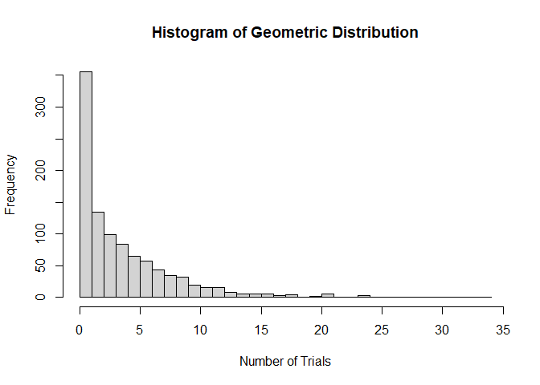

FA6
================
Cuerdo, Naomi Hannah A.
2024-02-28

## Part 1

**I. Geometric Distribution.** Provide an R code for the geometric
distribution. The geometric distribution is a probability distribution
that models the number of trials required to achieve the first success
in a sequence of Bernoulli trials, where each trial has a constant
probability of success.

1.  Set the probability of success: p \<- 0.2

``` r
P <- 0.2
```

2.  Generate 1000 random variables from the geometric distribution.

``` r
x <- rgeom(1000, prob = P)
```

3.  Calculate some basic statistics: mean_x \<- mean(x)

var_x \<- var(x)

sd_x \<- sd(x)

``` r
mean_x <- mean(x)
mean_x
```

    ## [1] 3.94

``` r
var_x <- var(x)
var_x
```

    ## [1] 18.31071

``` r
sd_x <- sd(x)
sd_x
```

    ## [1] 4.279102

4.  Print the results in item 3 with the following output (string):
    Number of trials required to achieve first success:

Mean (in 2 decimal places):

Variance (in 2 decimal places):

Sandard deviation ( in 2 decimal places):

``` r
cat("Number of trials to achieve the first success: ", min(x))
```

    ## Number of trials to achieve the first success:  0

``` r
cat("Mean: ", sprintf("%.2f", mean_x))
```

    ## Mean:  3.94

``` r
cat("Variance: ", sprintf("%.2f", var_x))
```

    ## Variance:  18.31

``` r
cat("Standard deviation: ", sprintf("%.2f", sd_x))
```

    ## Standard deviation:  4.28

5.  Plot the histogram of the results.

``` r
hist(x, breaks = seq(min(x), max(x)+1, by = 1), main = "Histogram of Geometric Distribution", xlab = "Number of Trials", ylab = "Frequency")
```

<!-- -->

## Part 2

**II. Hypergeometric Distribution.** Consider a plant manufacturing IC
chips of which 10% are expected to be defective. The chips are packed in
boxes for export. Before transportation, a sample is drawn from each
box. Estimate the probability that the sample contains more than 10%
defectives, when:

**1. A sample of 10 is selected from a box of 40**

``` r
Nchips1 <- 40
defective1 <- 0.1 * Nchips1
nchips1 <- 10 
prob_num1 <- 1- sum(dhyper(0:1, defective1, Nchips1 - defective1, nchips1))
```

``` r
cat("Probability of a sample when 10 is selected from a box of 40:  ",prob_num1, "or", sprintf("%.2f%%", prob_num1 * 100), "\n")
```

    ## Probability of a sample when 10 is selected from a box of 40:   0.2558814 or 25.59%

The probability of getting a sample containing more than 10% chips from
a box of 40 chips is approximately 25%, which is relatively low,
suggesting that it is not likely to encounter a specific number of
defective chips in the sample.

**2. A sample of 10 is selected from a box of 5000.**

``` r
Nchips2 <- 5000
defective2 <- 0.10 * Nchips2
nchips2 <- 10
prob_num2 <- 1- sum(dhyper(0:1, defective2, Nchips2 - defective2, nchips2))
```

``` r
cat("Probability of a sample when 10 is selected from a box of 5000:  ", prob_num2, "or", sprintf("%.2f%%", prob_num2 * 100), "\n")
```

    ## Probability of a sample when 10 is selected from a box of 5000:   0.2638622 or 26.39%

The probability of getting a sample containing more than 10% chips from
a box of 5000 chips is approximately 26%, which is slightly higer than
the first box of 40, suggesting that there is a higher chance of getting
defective chips from this sample, though it is not that the chances are
not overwhelmingly high.
