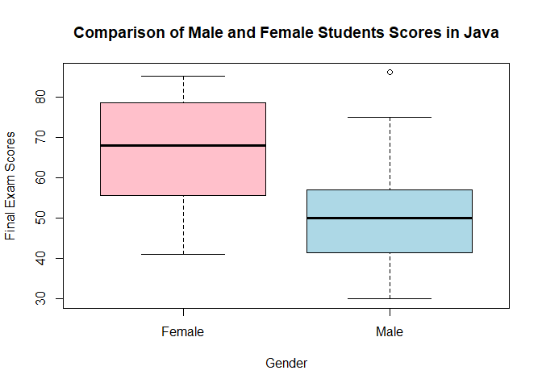

FA1
================
Cuerdo, Naomi Hannah A.
2024-02-01

## Question 1

Write the skewness program, and use it to calculate the skewness
coefficient of the four examination subjects in results.txt
(results.csv). What can you say about these data?

Write a program to calculate this and apply it to the data in
results.txt (results.csv). Is it a reasonable approximation?

Given the Pearson’s formula for the skewness and the skewness function,
the results for the subjects are as follows:

``` r
results <- read.csv("C:\\Users\\Naomi\\Downloads\\results.csv", header= TRUE)
library(moments)

#mean of each column
sapply(results[2:5], mean, na.rm = TRUE)
```

    ##   arch.1   prog.1    arch2    prog2 
    ## 64.48739 59.70588 53.58824 56.89076

``` r
#median of each column
sapply(results[2:5], median, na.rm = TRUE)
```

    ## arch.1 prog.1  arch2  prog2 
    ##     69     64     48     61

``` r
#sd of each column
sapply(results[2:5], sd, na.rm = TRUE)
```

    ##   arch.1   prog.1    arch2    prog2 
    ## 24.73687 23.64187 23.29705 28.61338

``` r
#number 1

#skewarch1
3*(mean(results$arch.1, na.rm = TRUE) - median(results$arch.1, na.rm = TRUE))/sd(results$arch.1, na.rm = TRUE)
```

    ## [1] -0.5472727

``` r
#skewarch1 using skewness function
skewness(results$arch.1, na.rm = TRUE)
```

    ## [1] -0.5085663

``` r
#skewprog1
3*(mean(results$prog.1, na.rm = TRUE) - median(results$prog.1, na.rm = TRUE))/sd(results$prog.1, na.rm = TRUE)
```

    ## [1] -0.5448956

``` r
#skewprog1 using skewness function
skewness(results$prog.1, na.rm = TRUE)
```

    ## [1] -0.3104593

``` r
#skewarch2
3*(mean(results$arch2, na.rm = TRUE) - median(results$arch2, na.rm = TRUE))/sd(results$arch2, na.rm = TRUE)
```

    ## [1] 0.7196062

``` r
#skewarch2 using skewness function
skewness(results$arch2, na.rm = TRUE)
```

    ## [1] 0.4532101

``` r
#skewprog2
3*(mean(results$prog2, na.rm = TRUE) - median(results$prog2, na.rm = TRUE))/sd(results$prog2, na.rm = TRUE)
```

    ## [1] -0.4308381

``` r
#skewprog2 using skewness function
skewness(results$prog2, na.rm = TRUE)
```

    ## [1] -0.2799966

The skewness values obtained using Pearson’s formula and the skewness
function are slightly different for each column. Thus, the approximation
can considered reasonable since the differences are relatively small.
Skewness is a measure of the asymmetry of a probability distribution,
and it is common for different skewness formulas to give slightly
different results, so as long as one understands the characteristics of
the data and the properties of the skewness formula used, the result can
still be reasonable. Thus, the approximation is reasonable despite
having small differences, but the data should be interpreted with other
statistical measurements and the nature of the data should be
considered.

## Question 2

For the class of 50 students of computing detailed in Exercise 1.1, use
R to (a) form the stem-and-leaf display for each gender, and discuss the
advantages of this representation compared to the traditional histogram;
(b) construct a box plot for each gender and discuss the findings

Stem and leaf diagrams portray the shape and spread of a continuous data
distribution. They are similar to histograms but use digits instead of
bars. Stem and leaf diagrams help identify different statistical tools
such as the central tendency and skewness of the distribution (Frost,
2021).

### Stem and Leaf Diagram for Female Students

``` r
female_students <-c(57, 59, 78, 79, 60, 65, 68, 71, 75, 48, 51, 55, 56, 41, 43, 44, 75, 78, 80, 81, 83, 83, 85)

cat("Stem-and-leaf display for Female students:\n")
```

    ## Stem-and-leaf display for Female students:

``` r
stem(female_students)
```

    ## 
    ##   The decimal point is 1 digit(s) to the right of the |
    ## 
    ##   4 | 1348
    ##   5 | 15679
    ##   6 | 058
    ##   7 | 155889
    ##   8 | 01335

Figure 1. Stem-leaf diagram for female students

Figure 1 diagram shows the range of exam scores for female students. The
leftmost digits are tens, while the rightmost digits are units. In the
diagram, most female students scored in the 50s and 70s, as shown in
stems 5 and 7. The distribution is also symmetric around the median as
the score lies around the 50s and 70s.

### Stem and Leaf Diagram for Female Students

``` r
male_students <-c(48, 49, 49, 30, 30, 31, 32, 35, 37, 41, 86, 42, 51, 53, 56, 42, 44, 50, 51, 65, 67, 51, 56, 58, 64, 64, 75)
cat("Stem-and-leaf display for male students:\n")
```

    ## Stem-and-leaf display for male students:

``` r
stem(male_students)
```

    ## 
    ##   The decimal point is 1 digit(s) to the right of the |
    ## 
    ##   3 | 001257
    ##   4 | 1224899
    ##   5 | 01113668
    ##   6 | 4457
    ##   7 | 5
    ##   8 | 6

Figure 2. Stem-leaf diagram for male students

Figure 2 shows the range of exam scores for male students. The leftmost
digits are tens, while the rightmost digits are units. The diagram,
indicates a wider range of scores compared to female students, as most
male students scored 40s, 50s, and 60s, as indicated by stems 4, 5, and
6. The distribution is less symmetric compared to the female students,
as it is skewed towards the right.

Using a stem and leaf diagram is advantageous compared to histograms as
they display the original data, while histograms summarize them (Frost,
2021). They are also visually appealing, as one can determine the
symmetry of the data. Thus, stem and leaf diagrams are more advantageous
compared to histograms because they are easy to identify the exact
values, preserve raw data, and are effective for visualizing skewed data
as well as interpreting smaller datasets.

### Box plot for Male and Female Students

``` r
data_summary <-list(Female = female_students, Male = male_students)

boxplot(data_summary, col = c("pink", "lightblue"), main = "Comparison of Male and Female Students Scores in Java", xlab = "Gender", ylab="Final Exam Scores", names = c("Female", "Male"))
```

<!-- -->

``` r
iqr_female <- IQR(female_students)
iqr_male <- IQR(male_students)
potential_outliers_f <- boxplot(female_students, plot = FALSE)$out
potential_outliers_m <- boxplot(male_students, plot = FALSE)$out
```

Figure 3. Box diagram for male and female students

Figure 3 shows the box diagram for male and female students. From the
female students’ box plot, the median exam score (the horizontal line
inside the box) is in the middle of the interquartile range (IQR),
indicating a balanced distribution of the scores. It is also compact,
which suggests a moderate speed of average scores. The vertical lines
extend from the box to the data points, which indicates the range of
data within a certain limit. The individual points

On the other hand, the median of the male students’ box plot is slightly
below the center of the IQR, which indicates a middle-range
concentration of scores. There is also a presence of a potential outlier
outside the vertical lines that extend from the box, which suggests a
low value in the dataset.

Overall, both box plots show that the scores are around the median, with
the male students showing a slightly wider and leaner distribution to
the right as shown in the diagram.

References: Frost, J. (2021, October 16). Stem and Leaf Plot: Making,
Reading & Examples. Statistics by Jim.
<https://statisticsbyjim.com/graphs/stem-and-leaf-plot/#>:~:text=They%20can%20help%20you%20identify,while%20histograms%20only%20summarize%20them.
